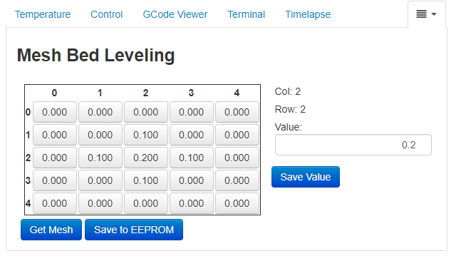

# OctoPrint-ManualMeshEditor

Manual Mesh Editor allows a user to manually edit points of a mesh for Mesh Bed Leveling in Marlin. At this time, only Mesh Bed Leveling is supported, the mesh is retrieved with `G29 S0` and edited with `G29 S3`.

## Setup

Install ~~via the bundled [Plugin Manager](https://docs.octoprint.org/en/master/bundledplugins/pluginmanager.html)
or~~ manually using this URL:

    https://github.com/The-EG/OctoPrint-ManualMeshEditor/archive/main.zip

## Configuration

**Mesh Grid Size:** the size of the mesh to use if one is not already defined. It's not possible to determine the mesh size if it doesn't already exist, so this number will be used instead. It will automatically be updated for existing meshes and once a new mesh is created.

**Mesh Minimum Value:** the minimum Z value allowed to be entered on the Manual Mesh Editor tab. You can still override this, but the down button will not go past this value.

**Mesh Maximum Value:** the maximum Z value allowed to be entered on the Manual Mesh Editor tab. You can still override this, but the up button will not got past this value.

**Mesh Value Increment Amount:** the amount that the up and down buttons on the Manual Mesh Editor tab increment or decrement the Z value by. You can always manually enter numbers more precise than this value.
